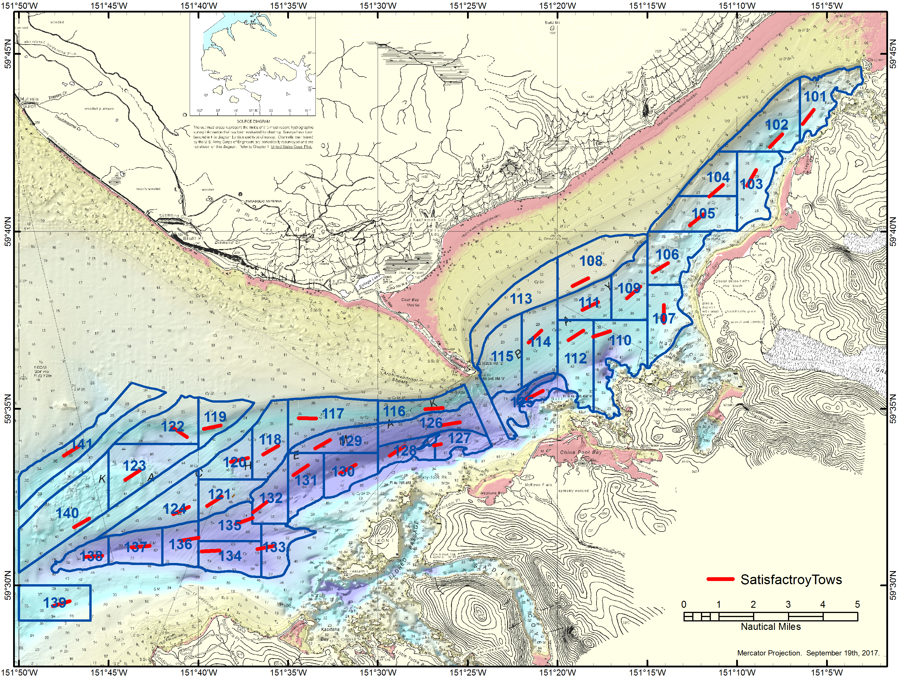
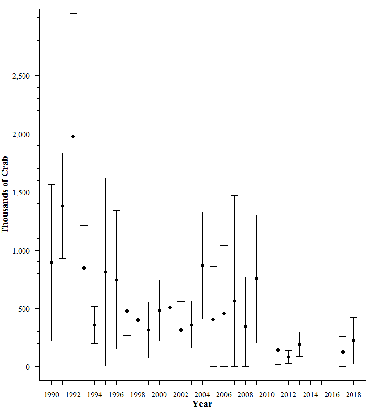
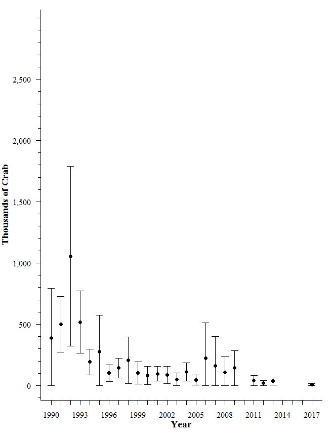
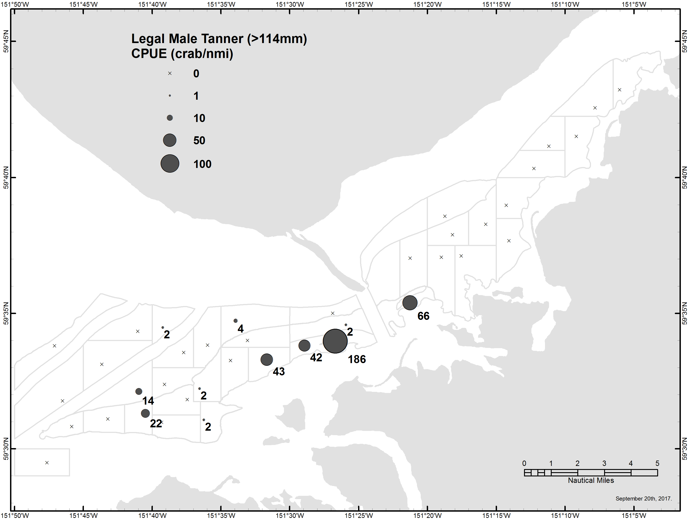
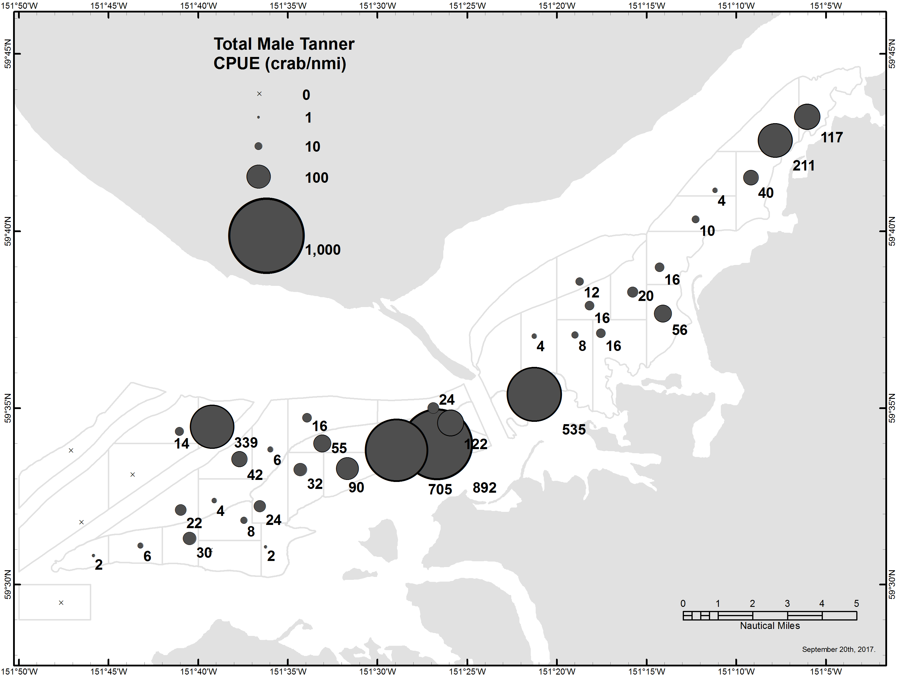
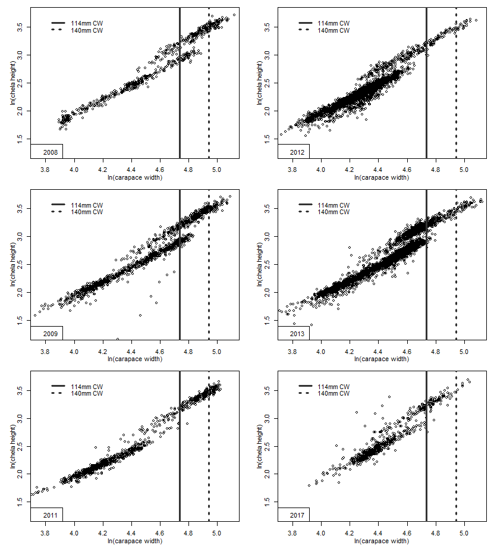
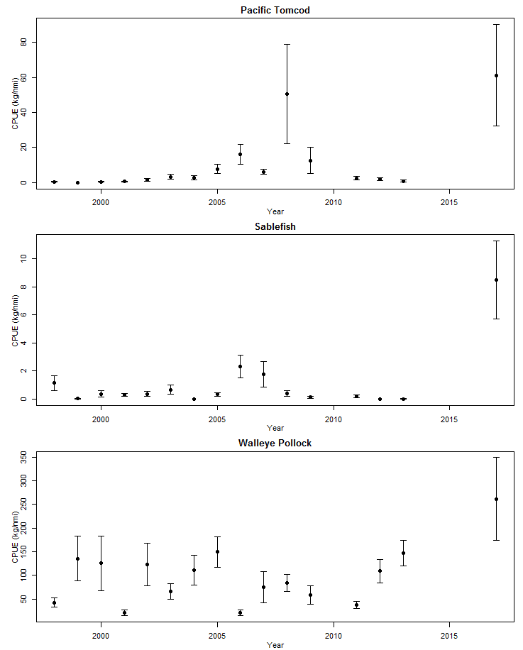

```{r, echo=FALSE, message=FALSE, warning=F}
library(knitr)
library(xtable)
library(tidyverse)
library(kableExtra)
options(scipen=9999) # remove scientific notation
knitr::opts_chunk$set(echo = FALSE, message=F, warning=F)
```

The 2017 Southern District large-mesh bottom trawl survey was conducted between August 29th and September 6th.  A total of 39 successful 0.5 nmi tows were completed, including 38 core stations and 1 ancillary station (station 139).  1,481 male and 1,350 female Tanner crab were captured.

The recruit class size definitions for male Tanner crab in Cook Inlet were revised in 2017, coinciding with a reduction in the legal size limit from 140 mm (5.5 in) to 114 mm (4.5 in) (Table 1).  The new 2017 size class definitions are anticipated to be the focus from this point on, however for historical comparison the entire time series of survey data (1990 to 2017) were analyzed using both sets of recruit classes herein.

Using the new legal size (114 mm), 137 legal males were captured in the 2017 survey.  Mean legal male CPUE was 10.12 crab/nmi (CV = 3.22) and ranged from 0 to 186.  The estimated abundance of legal males using the new legal size was 124,965 crabs (95% CI = 132,244).  When the new size limits were retroactively applied to the historical survey data, the 2017 legal abundance estimate was the 2nd lowest on record, surpassing only 2012 (Table 2; Figure 2).

Using the old legal size (140 mm), 8 legal males were captured in the 2017 survey.  When analyzed using the old size categories, the 2017 survey produced the lowest legal male abundance estimate on record, 7,078 crab (+/- 8,329) (Table 3; Figure 3).      

Male Tanners, especially large males were concentrated in the trench north of Gull Island and Anisom Point (Figures 4 and 5). 
   
Legal male Dungeness crab CPUE in the 2017 survey was the greatest since 2008, but less than all but 2 prior years (Table 6).

Pollock, tomcod and especially sablefish CPUE were all at record highs this year (Figure 7).  Sablefish CPUE this year was more than twice that of any other year.  

\newpage
\listoftables
\listoffigures



\hfill\break
\hfill\break
\hfill\break

```{r, results='asis', echo=F}
read.csv("../data/ClassLUT_T04931_2017.csv") %>%
 select('Recruit category' = Recruit.category, 'pre-2017'= pre.2017, '2017' = X2017) -> LUT
  print(xtable(LUT, caption = 'Male Tanner crab recruit class size definitions (carapace width in millimeters) used in the Southern District trawl surveys.'),
        comment=FALSE, include.rownames = FALSE , caption.placement = "top")
```  


\newpage
```{r, results='asis', echo=F}
read.csv("../output/931PopMales_Main_17.csv") %>%
    select(Year = YEAR, Tows = n, 'Pre-4 (<66)' = P4, 'Pre-3 (66-79)' = P3,
           'Pre-2 (80-95)' = P2, 'Pre-1 (96-113)' = P1,
           'Abund. (>114)'= LM_P_, '95% CI'= LM_P_CI_, 'Abund.' = TM_P_, '95% CI '= TM_P_CI_ ) %>%
    mutate (Year = as.factor(Year)) %>%
    mutate_if(is.numeric,funs(prettyNum(., big.mark=","))) %>%
    mutate (Year = as.numeric(as.character(Year))) %>%
    add_row(Year = c(2010,2014:2016), 'Pre-1 (96-113)' = rep('No_Survey',4)) %>%
    mutate_all(funs(replace(., is.na(.), '-'))) %>%
    arrange(Year) -> LM17

kable(LM17, format = "latex", booktabs = T, align = 'r',
      caption="Male Tanner crab abundance estimates using the 2017 size class definitions from trawl surveys in the Southern District, 1990-2017. Parenthetical size limits are carapace width in millimeters.") %>%
kable_styling() %>%
add_header_above(c(" " = 2, "Pre-Recruits" = 4, "Legal Males" = 2, "Total Males" = 2))%>%
column_spec(1:2, width = "1.3em") %>%
column_spec(3:6, width = "3.9em")%>%
column_spec(7, width = "4.5em") %>%
column_spec(8, width = "3.9em") %>%
column_spec(9, width = "4.6em") %>%
column_spec(10, width = "3.9em")

read.csv("../output/931PopMales_Main_old.csv") %>%
    select(Year = YEAR, Tows = n, 'Pre-4 (<70)' = P4, 'Pre-3 (70-91)' = P3,
           'Pre-2 (92-114)' = P2, 'Pre-1     (115-139)' = P1,
           'Abund. (>140)'= LM_P_, '95% CI'= LM_P_CI_, 'Abund.' = TM_P_, '95% CI '= TM_P_CI_ ) %>%
    mutate (Year = as.factor(Year)) %>%
    mutate_if(is.numeric,funs(prettyNum(., big.mark=","))) %>%
    mutate (Year = as.numeric(as.character(Year))) %>%
    add_row(Year = c(2010,2014:2016), 'Pre-1     (115-139)' = rep('No_Survey',4)) %>%
    mutate_all(funs(replace(., is.na(.), '-'))) %>%
    arrange(Year) -> LM17

kable(LM17, format = "latex", booktabs = T, align = 'r',
      caption="Male Tanner crab abundance estimates using the pre-2017 size class definitions from trawl surveys in the Southern District, 1990-2017. Parenthetical size limits are carapace width in millimeters.") %>%
kable_styling() %>%
add_header_above(c(" " = 2, "Pre-Recruits" = 4, "Legal Males" = 2, "Total Males" = 2))%>%
column_spec(1:2, width = "1.3em") %>%
column_spec(3:5, width = "3.9em")%>%
column_spec(6, width = "4em") %>%
column_spec(7, width = "4.5em") %>%
column_spec(8, width = "3.9em") %>%
column_spec(9, width = "4.6em") %>%
column_spec(10, width = "3.9em")
```  

```{r, results='asis', echo=F}
read.csv("../output/931PopFems_Main.csv") %>%
  select(Year = year, Tows = tows, 'Juvenile' = FT11_P_, '95% CI' = FT11_P_CI_,
         'Abund.' = MF_P_, '95% CI ' = MF_P_CI_, 
         'Abund. ' =TF_P_, '95% CI  ' = TF_P_CI_) %>%
         
  mutate (Year = as.factor(Year)) %>%
  mutate_if(is.numeric,funs(prettyNum(., big.mark=","))) %>%
  mutate (Year = as.numeric(as.character(Year))) %>%
  add_row(Year = c(2010,2014:2016), 'Abund.' = rep('No Survey',4)) %>%
  mutate_all(funs(replace(., is.na(.), '-'))) %>%
  arrange(Year) -> fem

kable(fem, format = "latex", booktabs = T, align = 'r',
      caption="Female Tanner crab abundance estimates from trawl surveys in the Southern District, 1990-2017.") %>%
  kable_styling() %>%
  add_header_above(c(" " = 2, "Juvenile" = 2, "Mature" = 2, "Total Females" = 2))
```

\pagebreak
\newpage






```{r, results='asis', echo=F}
read.csv("../output/2017T04_931CatchByStation_17sc.csv", colClasses=rep("character"),11) %>% 
  select(Station, 'Pre-4' = Pre4, 'Pre-3' = Pre3, 'Pre-2' = Pre2, 'Pre-1' = Pre1, Recruit, 'Post-Rec.' = Post,
    'Total' = TotMales, 'Juvenile' = JuvFems, 'Mature' = MatFems,
    'Total ' = TotFems) %>%
kable( format = "latex", booktabs = T, align = 'r',
    caption="Number of Tanner crab caught in the 2017 Southern District trawl survey categorized using the 2017 size classes.") %>%
kable_styling() %>%
add_header_above(c(" " = 1, "Sublegal" = 4, "Legal" = 2)) %>%
add_header_above(c(" " = 1, "Males" = 7, "Females" = 3))
```







```{r, results='asis', echo=F}
read.csv("../output/910_pm_170920.csv") %>%
  filter (Proj == 'T04') %>% 
  select('Year' = Year, 'Tows' = n, 'CPUE'= SM_CBar, 'SD' = SM_SD, 'CPUE ' = LM_CBar, 'SD ' = LM_SD,
         'CPUE  ' = TM_CBar, 'SD  ' = TM_SD, 'CPUE     ' = TF_CBar, 'SD     ' = TF_SD) %>% mutate_all(funs(round(.,2))) %>%
  add_row(Year = c(2010,2014:2016), 'CPUE' = rep('No Survey',4)) %>%
  mutate_all(funs(replace(., is.na(.), '-'))) %>%
  arrange(Year) -> dung

dung %>% kable(format = "latex", booktabs = T, align = 'r',caption = 'Dungeness crab CPUE (crab/nmi) in the Southern Distric trawl survey, 1990 to 2017.') %>% 
kable_styling() %>%
add_header_above(c(" " = 2, "Sublegal" = 2, "Legal" = 2, "Total" = 2, "Total" = 2 )) %>%
add_header_above(c(" " = 2, "Males" = 6, "Females" = 2)) 
```


